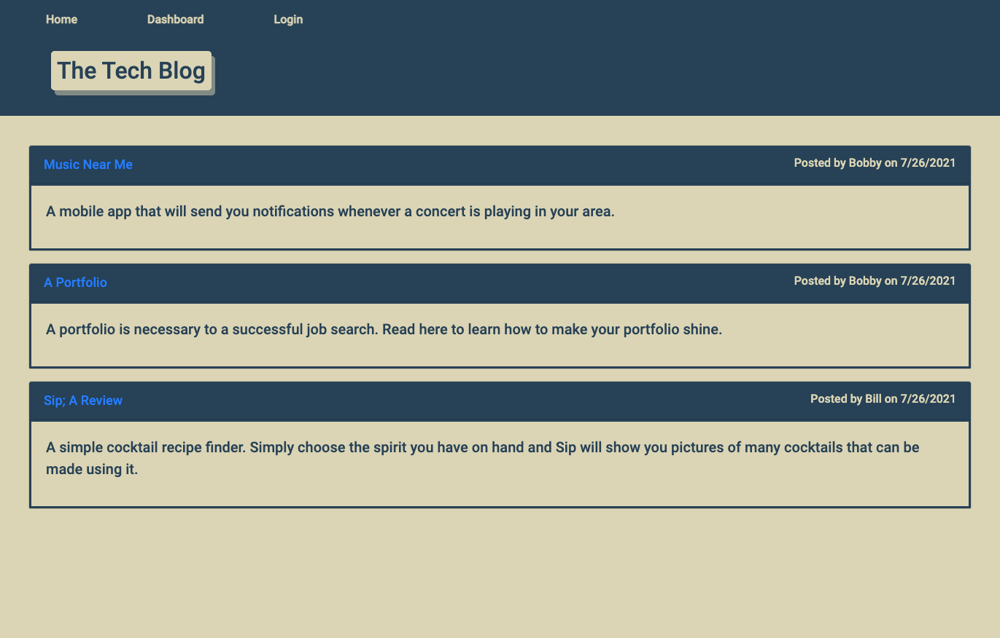

# 14 Model-View-Controller (MVC)

## Creating a Tech Blog

This is the fourteenth assignment for the MSU Coding Bootcamp; to create a CMS-style blog from scratch -- front-end to backend -- and deployed on Heroku.  Using the Model-View-Controller paradigm, it uses Handlebars.js as the templateing language, Sequelize for object-relational mapping, and express-session npm package for authentication.

The app allows the user to see all of the blog posts on the homepage, view an individual post with all comments, and, when logged in, to leave a comment on a post. The user is prompted to login or sign up before being able to create a blog post.  When signed in, the user can create, edit, or delete their own blog posts from their user dashboard page.

### Live Links
- [Daniel Shoup's Tech Blog Repisitory](https://github.com/danshoup/tech_blog)
- [Daniel Shoup's link to the deployed Tech Blog on Heroku](https://tech-blog-msu-2021.herokuapp.com/)

### Tech Blog Screenshot

## Acceptance Criteria

- When first visiting site, user is presented with homopage that includes all existing blog posts, navigation links for homepage and dashboard, and the option to login. 

- Clicking any link other than homepage prompts the user to login or signup to view other pages.

- Clicking on a blog post opens the post with any comments relating to it.  If logged in, the user has the option to create a comment on the blog post.

- User creates a username and password, and/or is logged in and taken to their dashboard page, where they can see a list of any blog posts that they have created, and the option to logout.

- Clicking on a blog post from the dashboard opens the blog post with the option to edit or delete it.

- When idle for longer than a set time, the user is logged out, and can view posts or comments, but has to log in again in order to add, edit, or delete.

- Folder structure follows the MVC paradim.

- App uses the 'express-handlebars' package to implement Handlebars.js for Views

- UI is is clean and polished, and user experience is intuitive and easy to navigate.

- Application resembles the mock-up provided in the homework instructions.

- Application must be deployed to Heroku

- Application must be deployed at a live URL, and load with no errors.

- GitHub URL must be submitted, and the repository must contain the application code.

- Application console is free of errors.

- Repository has a unique name and follows best practices for naming, indentation, comments, and contains descriptive commit messages.  The repository also contains a quality READMY file with description, screenshot,a nd link to deployed application.

- URL of the functional, deployed application, and the URL of the GitHub repository must be submitted.

